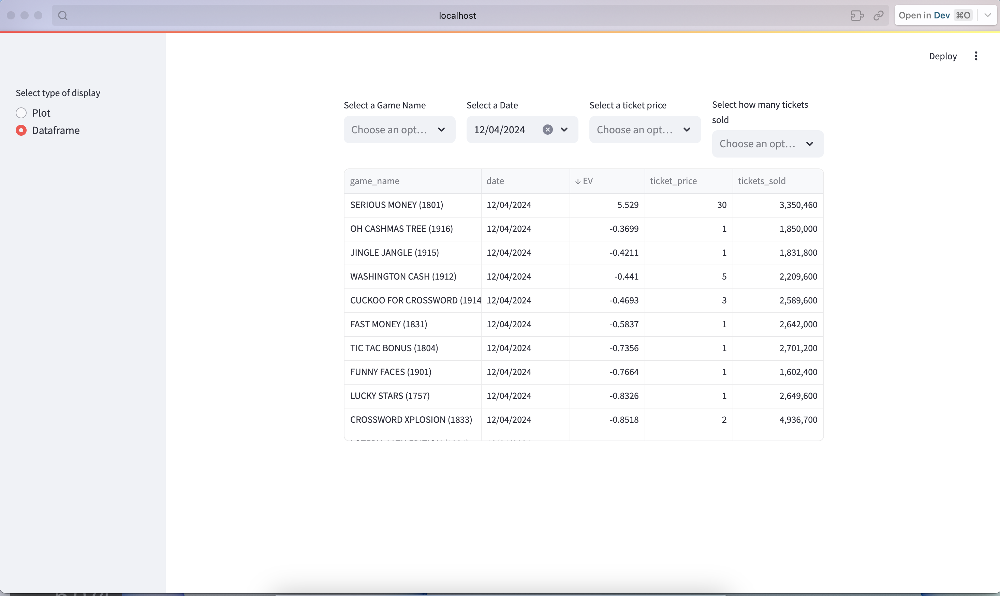

# WA Lottery Scratcher Analysis

## Overview
A Python-based tool that scrapes Washington State lottery scratch ticket data and performs expected value calculations to identify potentially profitable tickets.

## Features
- Automated scraping of WA lottery scratch ticket data
- Expected value calculations for each ticket type
- Real-time notifications for profitable opportunities
- Data persistence using MongoDB
- Automated browser interaction using Selenium

## Prerequisites
- Python 3.6 or higher
- MongoDB (running locally via Docker)
- Safari WebDriver (or another supported browser)
- Docker (for MongoDB)

## Installation

1. Clone the repository:
   ```bash
   git clone https://github.com/yourusername/WA_lotto_scratcher.git
   cd WA_lotto_scratcher
   ```

2. Install required dependencies:
   ```bash
   pip install -r requirements.txt
   ```

3. Set up MongoDB:
   ```bash
   docker run -d -p 27017:27017 --name mongodb mongo:latest
   ```

## Project Structure
- `main.py` - Entry point for the application, handles scraping and calculations
- `notify.py` - Notification system for profitable opportunities
- `Mongo.py` - MongoDB database interface and operations

## Configuration
1. **Browser Setup**: 
   - Default browser is Safari
   - To change browsers, modify line 56 in the scraping code:
     ```python
     driver = webdriver.Safari()  # Change to Chrome(), Firefox(), etc.
     ```

2. **MongoDB Setup**:
   - Ensure MongoDB is running locally (default: localhost:27017)
   - No authentication required for local development

## Usage

### Basic Usage
```bash
python main.py
```
This will:
1. Scrape current WA lottery scratch ticket data
2. Calculate expected values
3. Store results in MongoDB
4. Send notifications for profitable opportunities

### Monitoring
- The script will continuously monitor for changes in ticket data
- Notifications will be sent when profitable opportunities are detected

## Screenshot

*Screenshot of the lottery data analysis table in Streamlit*

## Development

### Adding New Features
1. Fork the repository
2. Create a feature branch
3. Submit a pull request

### Testing
- Run tests using:
  ```bash
  python -m pytest
  ```

## Troubleshooting

### Common Issues
1. **MongoDB Connection Issues**
   - Verify Docker container is running
   - Check MongoDB port availability

2. **Selenium Issues**
   - Ensure WebDriver is installed for your chosen browser
   - Check browser compatibility


## Contributing
Contributions are welcome! Please feel free to submit a Pull Request.

## Contact
[Add your contact information here]
